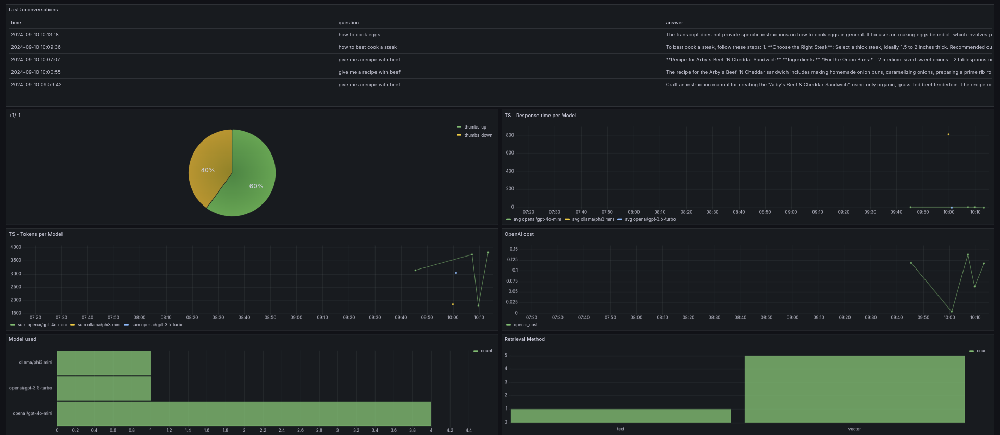

# YT-Cooking-Summaries

RAG implementation to transform video content from specific YouTube cooking channels into personalized recipes and helpful tips. 

This cooking assistant pulls insights directly from video transcripts, making it easy to access the information you need without watching the entire video.

With a flexible framework, this approach can be quickly adapted to other YouTube channels, allowing for the rapid creation of customized assistants in any niche.


## Flow

1. List all videos from a given list of YT Channels and build KB from:
    - title
    - video id
    - description
    - if it is a short format video *.
2. Index the KB on the concatenation of video title and description. 
3. Get user query through Streamlit.
4. Query the KB and retrieve relevant videos.
5. Get the transcripts of the relevant videos.
6. Call the LLM, asking it to summarize and retrieve recipes from the transcripts.
7. Output the summary through Streamlit.


~~~
* Note: Short format videos often have no description and have less structured dialogue, making them less ideal for this RAG.
~~~


## Dataset

The dataset is made of YT videos info - details and english transcript. The channel(s) from which to retrieve the videos needs to be predefined. The cooking channel [Joshua Weissman](https://www.youtube.com/@JoshuaWeissman) was used.

**YT Video Details** retrieved requiring:
`pip install google-api-python-client`


**YT Video Transcripts** retrieved requiring:
`youtube-transcript-api`


## Setup

This project uses `Docker Compose` to orchestrate various services for a scalable, AI-powered application. The setup includes:
- Elasticsearch for the vector db.
- LLM model served via Ollama, using Phi3-mini.
- Additional LLM model - chatGPT-4o-mini (if an OpenAI key is provided).
- Streamlit application for the front-end.
- PostgreSQL database to store user interactions and feedback.
- Grafana for monitoring, connected to PostgreSQL.

Locally, all endpoints are under the `localhost` domain.
On the docker network, their domain corresponds to each specific container name.

Python is used to build the Streamlit APP and interact with the different containers.

Uses `.env` for environment variables.

### Python Code
Built using the `src` layout and poetry. 
A simple `Makefile` is used to build the package, with commands:
- `make clean` - cleans the `dist`directory
- `make build` - builds an new package into `dist` directory.


The app contains below sub-modules:
- `db` - inits a postgres db in the postgres service and handles inserts.
- `grafana` - used to init a predefined Grafana dashboard (`dashboard.json`)
- `yt_info` - used to retrieve YT video data - basic details and transcript.
- `yt_rag` - contains the streamlit app (`streamlit_app.py`), RAG agent (`agent.py`) and the Elasticsearch Index init script (`build_index.py`*).

*`build_index.py` will read the static data present in the workspace and create the index from there.

### setup_python.sh
Used when starting up the `streamlit_app` container, installing dependencies, creating the Elasticsearch index and launching the Streamlit APP.


### Docker 
#### Elasticsearch
- Serving as a Vector DB.
- Runs as a single-node instance.
- Java heap size is set to 2Gb (default heap is very large).
- Container name: `elasticsearch`.
- Accessible on port `9200`.

#### LLM (Ollama)
- Serving pre-trained Ollama/phi3-mini LLM model.
- Custom setup script `install_phi3.sh` is used to install and configure the `phi3-mini` model.
- Model data is stored in a Docker volume to persist between container restarts.
- Container name `ollama`.
- Accessible on port `11434`.

#### Streamlit App
- Using `python:3.10`.
- Front-end to take user questions. Allows cycling between available models and different retrieval types.
- The application code is mounted from the `src` directory.
- Custom Python environment setup via `setup_python.sh`.
- Container name `streamlit_app`.
- `./data`directory with static video data.
- Depends on below containers:
    - Elasticsearch.
    - Ollama.
    - PostgreSQL.
- Available on port `8501`.

#### Postgres
- Used to store user interactions - questions and feedback.
- Container name `postgres`.
- Available on port `5432`.

#### Grafana
- Provides monitoring and visualization of metrics, logs, and other data avaialbel in postgres.
- Allows embedding dashboards for integration within the app.
- Container name `grafana`.
- ```user: 0```because of ownership issues when creating the grafana container.
- Depends on:
  - PostgreSQL.
- Available on port `3000`.

#### Volumes
- **ollama**: A Docker volume used to persist LLM model data.


### Notes
- Static video data is available due to YT API rate limits.
- Phi3-mini was chosen since it is free and small. 
- Only integrated for CPU usage. 
- Phi3-mini is very slow to run locally on CPU.


## How to Run

### Prerequisites

- Docker.
- Python's build module. ```pip install build```
- Clone the repo.
- Environment variables:
    1. Create copy of `sample.env` named `.env` in same directory.
    2. Fill in missing variables (runs without them):
        - `YT_API_KEY` - required to load different YT channels or new videos.
        - `OPENAI_API_KEY` - required to use any OPENAI models.


### Launching the Assistant

1. Open a terminal in the repo root.
2. Build the dist .whl file:
```bash
make build
```
3. Build the containers. This will:
    - Load the `Ollama/Phi3:mini`model (only if it is not available yet).
    - Load the data from the predefined YT channels.
    - Feed and index the KB.
        - This is only done if the index doesn't exist in ElasticSearch.
    - Load the Grafana dashboard.
    - Launch the Streamlit App in a browser.
```bash
docker compose up
```

4. Access it on `http:\\localhost:8501`.

#### Running local notebooks

Notebooks on data exploration, generating the ground truth and evaluating the retrieval can be found under `notebooks` directory.

The notebooks use the `LOCAL_*` environment variables.
Before running the notebooks, follow below steps with `python 3.10` - ideally on an empty virtual environment:

On a terminal window running on the root of the project:
```bash
make build
```

Followed by below:
```bash
pip install yt_summaries-0.4.4-py3-none-any.whl
```


### Evaluation

#### Retrieval - using Hit Rate and MRR

| **Evaluation Method**                 | **Old Prompt** (Hit Rate, MRR)                          | **New Prompt** (Hit Rate, MRR)                          |
|---------------------------------------|---------------------------------------------------------|---------------------------------------------------------|
| **Text Search on Title and Description**| `0.4738`, `0.3782`                                      | `0.4698`, `0.3652`                                      |
| **Cosine-KNN on Title**               | `0.5816`, `0.4664`                                      | `0.6141`, `0.4741`                                      |
| **Cosine-KNN on CONCAT (Title + Description)** | `0.6281`, `0.5038`                                      | `0.6626`, `0.5158`                                      |
| **Cosine-KNN on CONCAT (Title + Description) + Hybrid RFF** | `0.6325`, `0.5082`                                      | `0.6520`, `0.5120`                                      |


Given above results, the RAG uses Cosine-KNN on CONCAT (Title + Description) retrieval.	

#### RAG

No RAG evaluation was performed due to the time it takes to run some of the ground truth questions with Ollama/Phi3-mini and the price of ChatGPT LLMs to evaluate the answers. The live evaluation is also not implemented.


## Dashboard
The Dashboard was implemented using Grafana. It tracks:
- Latest conversations. 
- User feedback.
- Time Series on: 
    - Response Time per Model.
    - Tokens per Model.
    - OpenAI cost.
- Models used.
- Retrieval Method.




## Scoring Objectives
Keeping track of what is implemented, comparing to evaluation goals.

* Problem description
    * [x] 2 points: The problem is well-described and it's clear what problem the project solves
* RAG flow
    * [x] 2 points: Both a knowledge base and an LLM are used in the RAG flow 
* Retrieval evaluation
    * [x] 2 points: Multiple retrieval approaches are evaluated, and the best one is used
* RAG evaluation
    * [x] points: No evaluation of retrieval is provided

* Interface
    * [x] 2 points: UI (e.g., Streamlit), web application (e.g., Django), or an API (e.g., built with FastAPI) 
* Ingestion pipeline
    * [x] 2 points: Automated ingestion with a Python script or a special tool (e.g., Mage, dlt, Airflow, Prefect)
* Monitoring
    * [x] 2 points: User feedback is collected and there's a dashboard with at least 5 charts
* Containerization
    * [x] 2 points: Everything is in docker-compose
* Reproducibility
    * [x] 2 points: Instructions are clear, the dataset is accessible, it's easy to run the code, and it works. The versions for all dependencies are specified.
* Best practices
    * [x] Hybrid search: combining both text and vector search (at least evaluating it) (1 point)
    * [x] Document re-ranking (1 point)
    * [ ] User query rewriting (1 point)
    * [x] Added tests for the ETL into KB.


## To Do

- Error handling if Open Ai key is missing or invalid, when trying to ask using Open AI model.
- RAG evaluation
- Question rewriting


